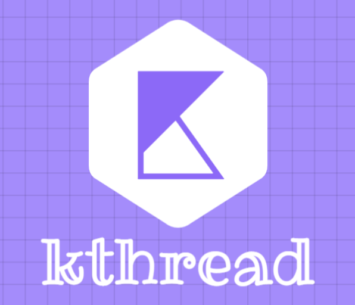
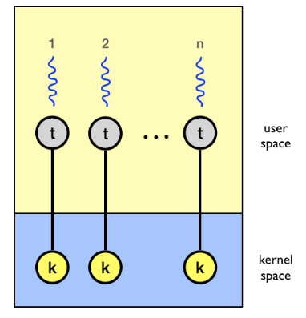
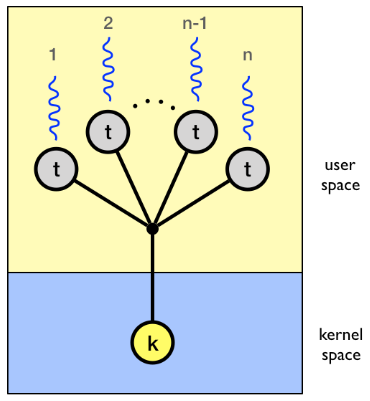
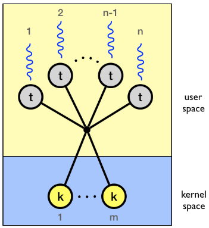

<h1 align="center">
  <a href="https://github.com/KunalC-1/Kthread">
    
  </a>
</h1>

<div align="center">
  A user level multi-threading library
  <br />
  <br />
  <a href="https://github.com/KunalC-1/Kthread/issues/new?assignees=&labels=bug&title=bug%3A+">Report a Bug</a>
  ·
  <a href="https://github.com/KunalC-1/Kthread/issues/new?assignees=&labels=enhancement&title=feat%3A+">Request a Feature</a>
  .
  <a href="https://github.com/KunalC-1/Kthread/discussions">Ask a Question</a>
</div>

<div align="center">
<br />

[](https://opensource.org/licenses/MIT)

[](<https://en.wikipedia.org/wiki/C_(programming_language)>)


[](https://github.com/KunalC-1/Kthread/issues?q=is%3Aissue+is%3Aopen+label%3A%22help+wanted%22)
[](https://github.com/KunalC-1)

</div>

<details open="open">
<summary>Table of Contents</summary>

-   [About](#information_source-about)
    -   [Built With](#hammer_and_pick-built-with)
-   [Getting Started](#-getting-started)
    -   [Usage](#-usage)
-   [Contributors](#-contributors)
-   [License](#-license)

</details>

---

## :information_source: About

<table>
<tr>
<td>

Kthread is a user level multithreading library in C for UNIX-like operating systems.<br/>
It can be used to achieve concurrency in program and it also provide locks to achieve synchronization.

User level threads are supported above the kernel in user space and are managed without kernel support.

Key features of **User Level Threads**:

-   Threads managed entirely by the run-time system (user-level library like Kthread).
-   Can be implemented on an OS that does not suport kernel-level threads.
-   Fast and efficient: switching threads not much more expensive than a function call.

Kthead supports three models of mapping user threads to kernel threads.

### 1.One-One :

Every user level thread executes on separate kernel thread.

<div align="center">

</div>

### 2.Many-One :

All user level thread execute on one kernel level thread.Only one thread executes at one time and then timer based preemption occurs so that other thead can execute

<div align="center">

</div>

### 3.Many-Many :

In this multiple user level threads executes on multiple kernel level threads

<div align="center">

</div>
</td>
</tr>
</table>

### :hammer_and_pick: Built With

-   [C language](<https://en.wikipedia.org/wiki/C_(programming_language)>)
-   [Testing - Acutest.h](https://github.com/mity/acutest/blob/master/include/acutest.h)

## ✨ Getting Started

### 🚀 Usage

> 1.Clone repository on your local unix machine and change current directory .

```
git clone git@github.com:KunalC-1/Kthread.git
cd Kthread
```

> 2.Run test cases

```
make runtest
```

## 🤝 Contributors

👤 **Kunal Chaudhari**

-   Github: [@KunalC-1](https://github.com/KunalC-1)

👤 **Kartik Mandhan**

-   Github: [@kartikmandhan](https://github.com/kartikmandhan)

## 📝 License

Copyright © 2022 [Kunal Chaudhari](https://github.com/KunalC-1) & [Kartik Mandhan](https://github.com/kartikmandhan)<br />
This project is [MIT](LICENCE.md) licensed.
